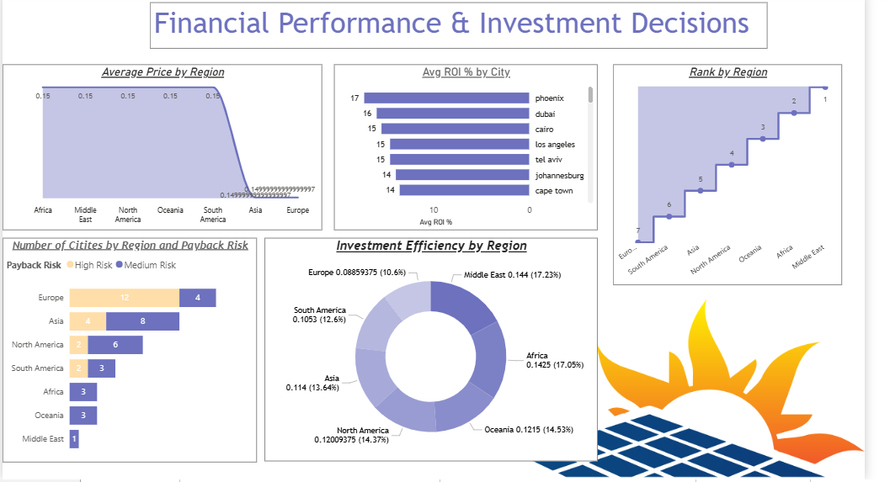
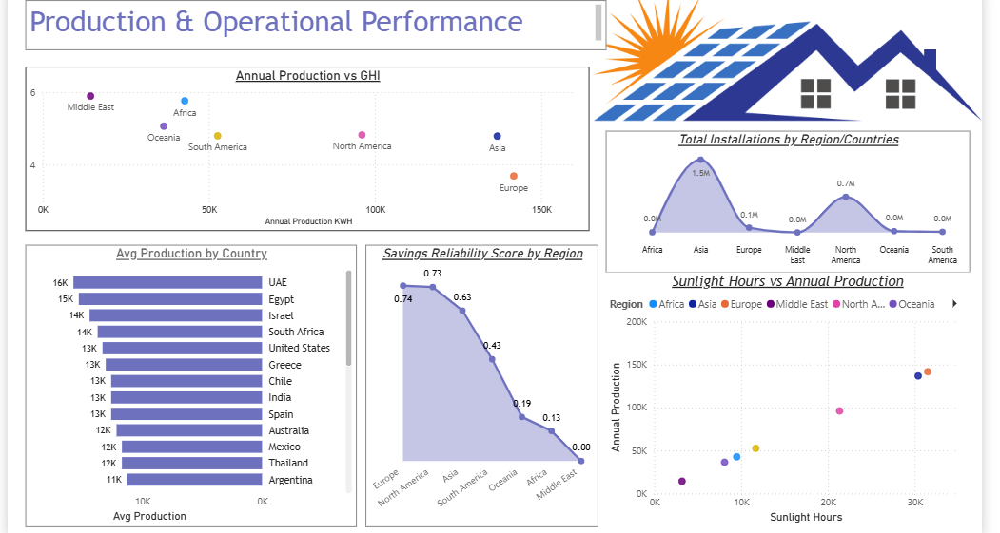
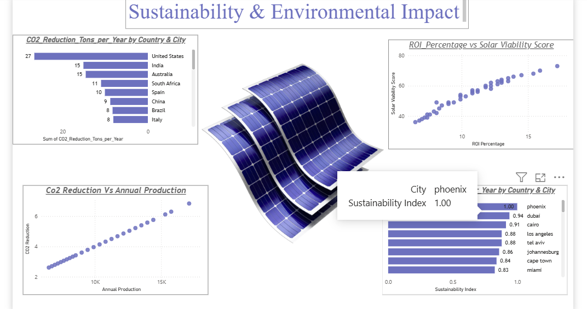

# ☀️ Solar Energy Performance Analysis Report

## 📊 Project Overview
This project presents a comprehensive analysis of global solar energy performance using Power BI and MySQL. It focuses on financial performance, operational efficiency, and environmental sustainability.

---

## 🔧 Tools & Technologies
- Power BI
- MySQL
- Data Analysis (EDA)

---

## 📈 Key Insights

### 💰 Financial Analysis
- Middle East & Africa show highest investment efficiency
- Phoenix and Cairo have highest ROI (~17%)
- Europe shows lower ROI rankings

### ⚙️ Operational Analysis
- Asia leads installations (~1.5M+)
- Strong correlation between sunlight hours and production
- Egypt & Israel show high production levels

### 🌱 Sustainability Analysis
- USA & India lead in CO2 reduction
- Higher solar viability → higher ROI
- Strong link between production and environmental impact

---

## 📊 Dashboard Preview

### Financial Dashboard

### Production Dashboard

### Sustainability Dashboard

---

## 📂 Files
- Power BI file (.pbix)
- Project Report (PDF)
- Dashboard Screenshots

---

## 🚀 Conclusion
This project demonstrates how solar energy data can be used to drive investment decisions and sustainability planning using data-driven insights.
